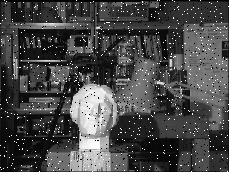

# Block Matching Algorithm for Image Denoising
A C++ implementation of Block Matching Algorithm that adapted for image denoising (well, I just tried it and it works). It uses the "SAD" (Sum of Absolute Differences) similarity metric.

## Input Image
The noisy image that used as input.

   

## Output Image
The denoised image that created at the output.

   

